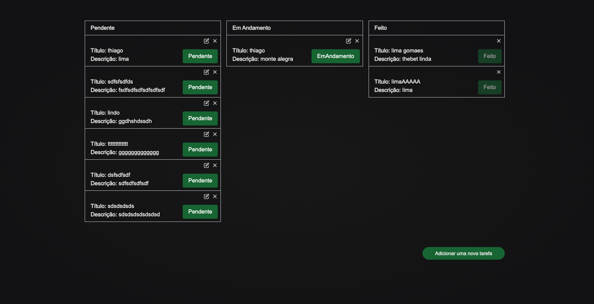
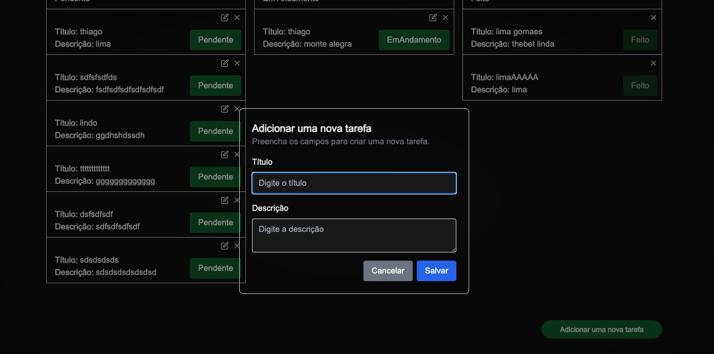
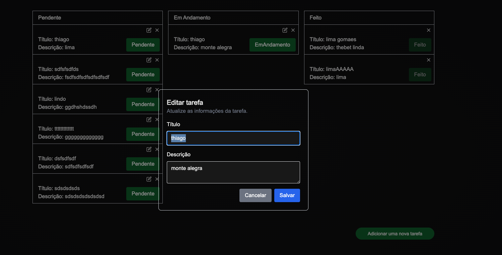
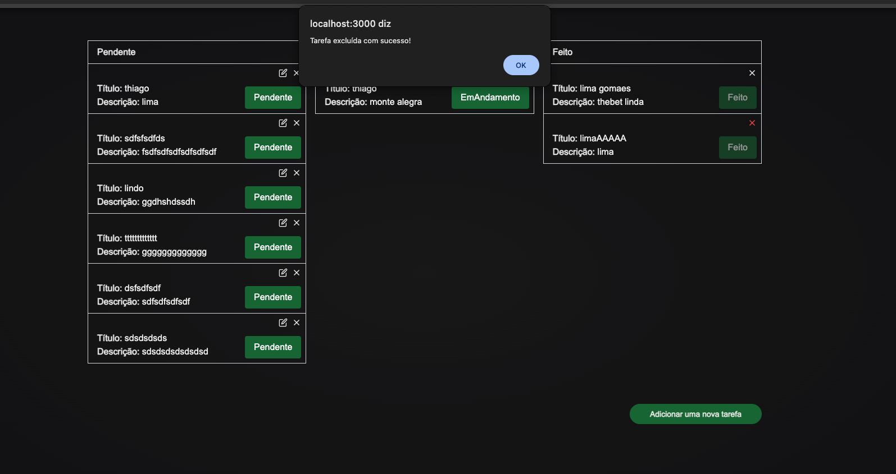

# Teste para Desenvolvedor Full Stack

Bem-vindo ao teste para desenvolvedor Full Stack! O objetivo deste teste é avaliar suas habilidades com **React** e **Node.js** na criação de um web app simples de controle de tarefas.

## 📌 Descrição do Projeto

Você deve desenvolver um **web app de controle de tarefas** com três colunas:

- **Pendente**
- **Em andamento**
- **Feito**

Cada tarefa deve conter:

- **Título**
- **Descrição**

### 🎯 Funcionalidades

- Adicionar uma nova tarefa
- Editar o título e a descrição de uma tarefa
- Mover uma tarefa entre as colunas
- Excluir uma tarefa
- O estado das tarefas pode ser armazenado na memória (não é necessário usar banco de dados)

## 🏗️ Tecnologias e Requisitos

O projeto deve ser desenvolvido como um **monorepo** utilizando as seguintes tecnologias:

- **Front-end**: React
- **Back-end**: Node.js
- **Gerenciador de pacotes**: npm, yarn

## 🚀 Como Executar o Projeto

### 1️⃣ Clonar o repositório

```sh
 git clone https://github.com/ighor-next/challenge.git
 cd challenge
```

### 2️⃣ Criar um branch para sua solução

```sh
 git checkout -b minha-solucao
```

### 7️⃣ Abrir um Pull Request

Acesse o repositório no GitHub e abra um Pull Request da sua branch **minha-solucao** para a branch principal do projeto.

## 🎯 O que Avaliaremos?

- Estrutura e organização do código
- Boas práticas de desenvolvimento
- Uso adequado do React e Node.js
- Clareza e legibilidade do código
- Manutenibilidade do projeto
- Uso de commits bem descritos

## 📝 Considerações Finais

Sinta-se à vontade para adicionar melhorias ao projeto caso ache necessário. Boa sorte! 🚀

# Lista de Tarefas

Lista de Tarefas para suas tarefas diárias!

## Objetivo

O objetivo principal do projeto é oferecer ao usuário uma plataforma organizada para gerenciar e revisar informações sobre suas tarefas diárias.

## Tecnologias

⚡️ Nest + Next
⚡️ Tailwind CSS
⚡️ npm-run-all
⚡️ tsup
⚡️ Radix UI
⚡️ Insomnia
⚡️ Prisma
⚡️ Docker (para banco de dados PostgreSQL)

## Funcionalidades

- CRUD
- Filtragem de tarefas
- Integração com APIs Externas
- Interface de Usuário Amigável
- Boas Práticas de Desenvolvimento






## Feedback

Avaliação das funcionalidades, qualidade do código e segurança são aspectos importantes para o projeto. Sugestões de melhorias ou relatos de problemas são bem-vindos.

## 📎 Links

https://www.linkedin.com/in/thiago-sombra-8a875b137/
https://github.com/thiagotsdelima

## Instalacao

### Dependencias

Para comerca a trablhar com o projeto "Lista de Tarefa", siga as etapas de instalacao:

1- **Criacao do Projeto com Next**

Para criar seu projeto usando Next, execute os eguinte comando no temrinal:

'''bash
npx create-next-app@latest frontend

### Instalacao das dependencias do projeto

Apos a criacao do projeto, va para o diretorio recem-criado e instale as dependencias necessarias:

Instale my_project com yarn

'''bash
cd my_project

- git clone git@github.com:sua_conta/sua_pasta/seu_projeto.git

- yarn
  backend: npx prisma migrate dev
  raiz: yarn dev

information:
nest cli
git config -- list
git status
git diff

execucao:
yarn dev
